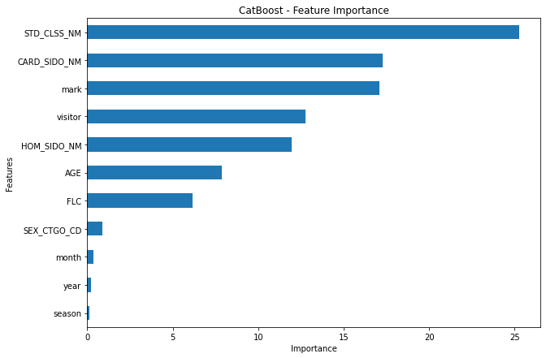

## Catboost model for Jeju Dacon

> 2020. 07.28


### Multiregression: objectives and metrics

| Name      | Used for optimization | User-defined parameters     | Formula and/or description                                   |
| --------- | --------------------- | --------------------------- | ------------------------------------------------------------ |
| MultiRMSE | +                     | use_weights *Default:* true |  is the identifier of the dimension of the label. |

### Code

```python
model = CatBoostRegressor(iterations=5000,              # 반복횟수
                           learning_rate=0.1,           # 러닝레이트
                           l2_leaf_reg=3.5,             # L2 정규화 계수
                           depth=8,                     # 트리 깊이
                           rsm=0.98,                    # Random subspace method
                           metric_period=1000,
                           loss_function= 'MultiRMSE',      
                           eval_metric= 'MultiRMSE',     # 성능 측정
                           use_best_model=True,
                           random_seed=42                # 랜덤시드 고정
                          ) 
```


### Train

```
0:	learn: 12.4634787	test: 12.4703335	best: 12.4703335 (0)	total: 595ms	remaining: 49m 35s
1000:	learn: 1.0048027	test: 1.0096809	best: 1.0096809 (1000)	total: 11m 9s	remaining: 44m 33s
2000:	learn: 0.8990818	test: 0.9064287	best: 0.9064287 (2000)	total: 22m 45s	remaining: 34m 6s
3000:	learn: 0.8500161	test: 0.8604828	best: 0.8604828 (3000)	total: 35m 17s	remaining: 23m 30s
4000:	learn: 0.8200369	test: 0.8332364	best: 0.8332364 (4000)	total: 48m 25s	remaining: 12m 5s
4999:	learn: 0.7997902	test: 0.8158042	best: 0.8158042 (4999)	total: 1h 2m 47s	remaining: 0us

bestTest = 0.8158041866
bestIteration = 4999
```


### Feature important



